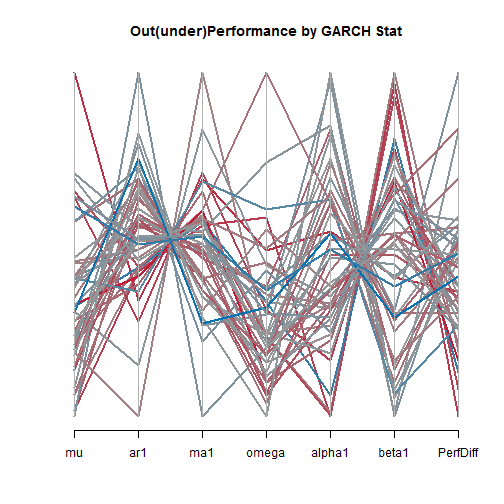
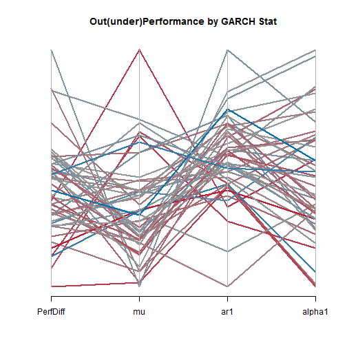
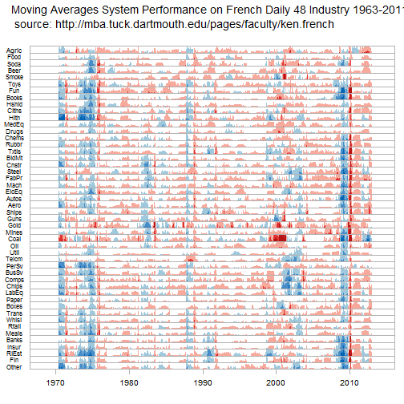

---
# GARCH and MA Outperformance
## Now Using d3 Parallel Coordinates with rCharts

Parallel coordinates become much more useful when they are interactive, so I will recreate one of my favorite blog posts ["Trend is Not Your Friend" Applied to 48 Industries](http://timelyportfolio.blogspot.com/2012/08/trend-is-not-your-friend-applied-to-48.html) and convert the chart to a living breathing d3 parallel coordinates chart courtesy of [Ramnath Vaidyanathan's rCharts](http://ramnathv.github.io/rCharts/) and [Kai Chang's d3.parcoords](http://syntagmatic.github.io/parallel-coordinates/). I will convert the scatter and horizon plots in a later post.  Note see 

<!--old post; left in html to demonstrate combination-->
# "Trend is Not Your Friend" Applied to 48 Industries

<em>Please see previous post <a href="http://timelyportfolio.blogspot.com/2012/06/crazy-rut-in-academic-context.html">Crazy RUT in Academic Context Why Trend is Not Your Friend</a>.</em>

  
I'll repeat the intro to the post mentioned above, so we can all get caught back up.

  
In response to <a href="http://timelyportfolio.blogspot.com/2012/06/where-are-fat-tails.html">Where are the Fat Tails?</a>, reader vonjd very helpfully referred me to this paper <a href="http://www.frankfurt-school.de/clicnetclm/fileDownload.do?goid=000000311260AB4" target="_blank">The Trend is Not Your Friend! Why Empirical Timing Success is Determined by the Underlying's Price Characteristics and Market Efficiency is Irrelevant</a> by Peter Scholz and Ursula Walther. The authors conclude

  <blockquote>
  
"Our study on the basis of real data clearly confirms the hypothesis that the asset price characteristics of the underlying price process have a crucial impact on timing results. This allows us to forecast the timing success depending on the market's parameters. An OLS regression analysis supports our predictions and verifies our assumption that the drift has the strongest influence on timing success. By contrast, the higher moments (skewness, kurtosis) seem not to have any significant impact on the timing result in the empirical sample. As we presumed, the level of market development, and hence the degree of efficiency, does not play any role. Trading worked coincidentally rather well in the developed world and quite poorly in the emerging markets. The driving factor for the timing success is the parametric environment the trading system stumbles on.

Our study contributes to the discussion by providing a structured analysis of the relevance of the most important price process parameters. As a result, the traditional explanations for timing success can be abandoned: we find that it is very likely for the SMA trading rule to generate excess returns over its benchmark if the underlying price path exhibits negative drifts, high serial autocorrelation, low volatilities of returns, and highly clustered volatilities. Drift and autocorrelation of the underlying asset seem to have the largest impact, though."
</blockquote>

One of my initial ideas for extending the research was to incorporate a much larger set of indexes over a longer period of time.&nbsp; As I was working on <a href="http://timelyportfolio.blogspot.com/2012/08/48-industries-since-1963.html">48 Industries Since 1963</a>, I decided 50 years of data on 48 different indexes would be a great dataset to apply the ideas and methods presented in the paper.

Using R and all its wonderful packages, it is surprisingly easy to accomplish.&nbsp; Let's see if we can test "drift and autocorrelation.have the largest impact" on excess returns with industries also.&nbsp; I'll try not to get too statistical.

In terms of drift or annualized return, we can see a linear inverse relationship between return and out(under)performance of the 200 day moving average system, so the better the performance of the industry, the less likely a moving average system is to outperform.

<table style="width: auto">
<tbody>
<tr>
<td></td></tr>
<tr>
<td style="text-align: right; font-family: arial,sans-serif; font-size: 11px">From <a href="https://picasaweb.google.com/115099029813395778077/TimelyPortfolio02?authuser=0&amp;feat=embedwebsite">TimelyPortfolio</a></td></tr></tbody></table>

In terms of the GARCH model effects on excess returns, a parallel coordinate chart will best start our exploration.&nbsp; Lines are colored by the excess return of a moving average system on each industry.

<h3>d3 Parallel Coordinates (go ahead and play with it)</h3>

<h3>Old Static R Parallel Coordinates (not as helpful)</h3> 
Mu and alpha1 seem to most heavily influence the ability of a moving average system to outperform.&nbsp; Let us isolate our chart to mu and alpha1 and add ar1 based on the findings of the authors.&nbsp; I am very tempted to try to explain GARCH here, but for the sake of brevity, I will refrain.&nbsp; This <a href="http://scholar.google.com/scholar?cluster=1570505569310094643&amp;hl=en&amp;as_sdt=0,1" target="_blank">paper</a> and this <a href="http://www.portfolioprobe.com/2012/07/06/a-practical-introduction-to-garch-modeling/" target="_blank">Portfolio Probe post</a> offer a good introduction to GARCH.

 
In conclusion, it seems the same effects observed by the authors also apply to US industry indexes.&nbsp; In future posts, I will add a little more statistical rigor to the analysis and apply to other indexes.

Now, I just cannot resist using a horizon plot to evaluate the rolling 250 day excess returns of a moving average system over buy and hold.&nbsp; As you can see, a bull market favors buy and hold.&nbsp; The 70s and 2008-2009 were very kind to a moving average approach.

<h3>Old Static R Horizon Plot</h3> 

